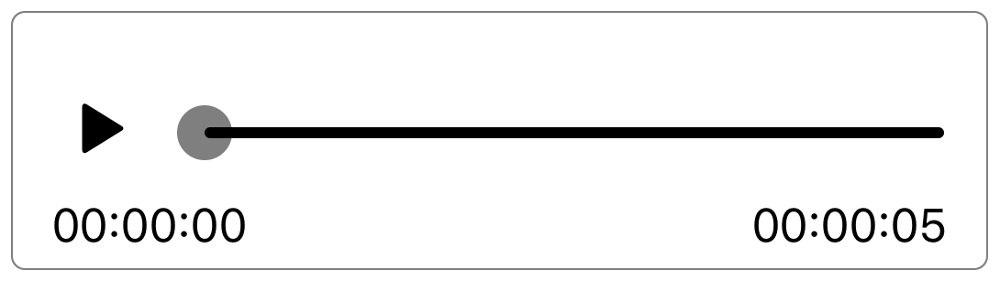

# Audio Player using Expo (React Native)

This app features an audio player with a play-button, an animated slider and a timestamp, which are all linked to a loaded audio-file. This app is independent of external libraries other than the ones required by Expo.



## Install & Run

Since this is a managed expo app, it requires the Expo app to be preinstalled on a smartphone.

```bash
npm install -g expo-cli
cd path/to/project
npm install
expo start
```

Scan the barcode with your smartphone.

## Implementation

* **Play/Pause**: Pressing the play-button will first play the audio-file and then start the animation of sliding the dot along the horizontal line. The Animated.Value is the offset of this dot ("dotOffset"). To launch this animation, Animated.timing is used. This requires how much time of the audio-file is still left to play (this can be calculated by calling the this.soundObject.getStatusAsync()) and what the maximum dotOffset can be.

* **Timestamp**: When the component mounts, a listener is added to dotOffset, which updates this.state.currentTime. This is required for the DigitalTimeString, which returns a string of hours:minutes:seconds when passed an integer (in miliseconds). This cannot be animated.

* **Moving slider**: Moving the slider requires usage of a PanResponder. Here, onPanResponderMove will calculate the changing dotOffset. Whenever the offset is smaller/larger than the bounds of the horizontal track, the dotOffset will be reset. Moving the slider will only affect the position of the audio-file after the slider is released.

* **Keeping dot within bounds**: To keep the dot within the bounds of the horizontal line, the track-width needs to be measured with onLayout. Furthermore, the moving component cannot use the dotOffset directly in it's translateX attribute, since it might be either less than 0 or larger than the track-width. Therefore, a clamped y=x interpolation is used, which can stop (/clamp) translateX at these boundaries. The dot can therefore not move past the horizontal line.
